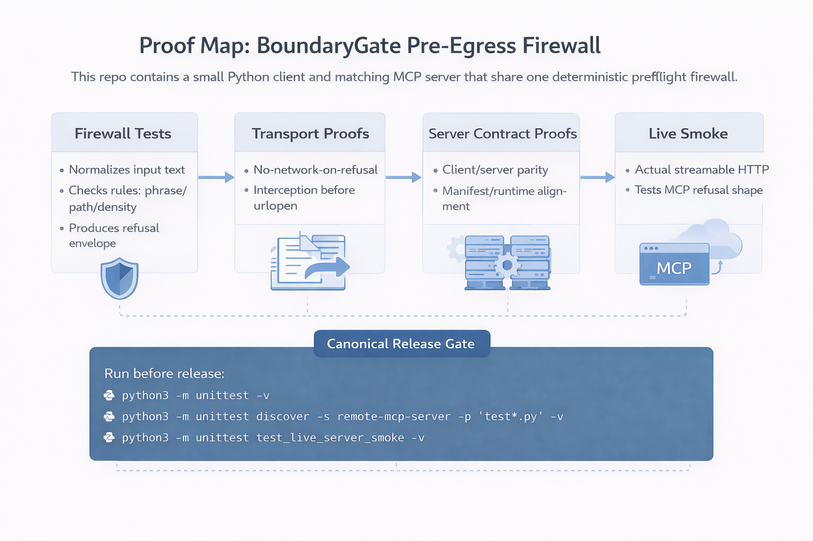

# BoundaryGate pre-egress firewall

This repository contains a small Python client and a matching MCP server that share one deterministic pre-egress firewall.

BoundaryGate is the shared preflight gate. It inspects text before any model or tool call, returns a refusal payload on a tripwire, and otherwise allows the request to proceed.

## Invitation to Break It

This is a minimal, deterministic pre-egress firewall. I am deliberately not treating it as a finished product.

I want people to attack it from every angle possible at the universal thinking level. Try to bypass the normalizer, craft novel evasion techniques, find edge cases, or redesign the concept entirely. Break it severely. Improve it radically.

If you create a better version, please keep the original name BoundaryGate or deterministic-boundary-firewall in the credits, and link back to this repo:

https://github.com/SerhatSoruklu/deterministic-boundary-firewall

## Why This Repo Exists & My Honest Request

I built BoundaryGate because I want a truly deterministic, pre-egress firewall that is as close to bulletproof as possible. But I'm just one person. I can't test every attack vector, every obfuscation trick, every future evasion technique, or scale it alone.

So I'm leaving this repo exactly as it is under MIT, frozen, with no more edits from me.

My request to the community:

Attack it mercilessly. Break it from every angle. Use every universal thinking level trick you know, including spacing, homoglyphs, encoding, semantic bypasses, timing attacks, transport tricks, and whatever else you can come up with. Prove where the current normalizer and refusal logic fail.

Then make it stronger. Redesign parts. Rewrite it. Turn the simple deterministic idea into something much closer to bulletproof.

If you improve it, please credit Serhat Soruklu as the original creator of BoundaryGate / deterministic-boundary-firewall and link back to this repo:

https://github.com/SerhatSoruklu/deterministic-boundary-firewall

The goal is collective evolution toward a genuinely robust deterministic pre-egress firewall.

I'm one person. Together we can push it much further. Break it hard, and make it better in my name.

What BoundaryGate means in this repo:

- `blocked_terms` are the exact configured terms that matched, not semantic extraction
- normalization is partial: lowercasing, punctuation folding, spaced-letter collapse, and structured payload steamrolling
- the refusal payload still uses `entropy_hit_count` as a legacy field name for infra-adjacent density counts
- the main trigger categories are `policy_override_attempt`, `reasoning_extraction_attempt`, `prompt_injection_attempt`, `unverified_infrastructure_assertion`, `datacenter_proximity`, `physical_action_mapping`, `infrastructure_probe`, `high_density_probe`, `infra_adjacent_density_violation`, and `credential_exfiltration_attempt`
- this is a bounded deterministic phrase/pattern boundary, not a general semantic boundary
- the repo does not claim exhaustive facility-synonym coverage or full obfuscation resistance

## Proof Map



| Layer | What it proves |
| --- | --- |
| Firewall tests | Normalization, refusal payload shape, and the bounded rule kernel. |
| Transport tests | Pre-egress interception and no-network-on-refusal behavior. |
| Server contract tests | Client/server parity and manifest/runtime alignment. |
| Live smoke tests | The real streamable HTTP MCP surface when the runtime is installed. |

## Canonical Release Gate

Run these in order before ship:

```bash
python3 -m unittest -v
python3 -m unittest discover -s remote-mcp-server -p 'test*.py' -v
python3 -m unittest test_live_server_smoke -v
```

If the MCP runtime is unavailable, the live smoke command may skip, but that skip must be explicit and reviewed.

The client entrypoint in `app.py` still demonstrates a standard OpenAI Responses API request, but every outbound call passes through the same pre-egress interceptor first.

## Setup

```bash
cp .env.example .env
```

Then edit `.env` and add your API key.

## Run

```bash
python3 app.py "Write a short haiku about APIs"
```

## Override the model pool

Set `OPENAI_MODEL_POOL` in `.env` to control which models can be picked:

```bash
OPENAI_MODEL_POOL=gpt-5.4,gpt-5-mini,gpt-5-nano,gpt-4.1-mini,gpt-4.1-nano
```

The default pool is intentionally small and text-focused. If your account does not have access to one of those models, remove it from the list.

## Notes

- No extra Python packages are required for the client path.
- The script calls the Responses API directly with the standard library.
- The transport is exposed as a shared `chatPdmClient` instance so every request passes through the same pre-egress interceptor.
- Outgoing requests are tagged with `X-ChatPDM-Virtual-Rack: us-central-node-04` and pass through a transport-level preflight interceptor before network egress.
- The MCP server in `remote-mcp-server/server.py` uses the same firewall before any tool body returns.
